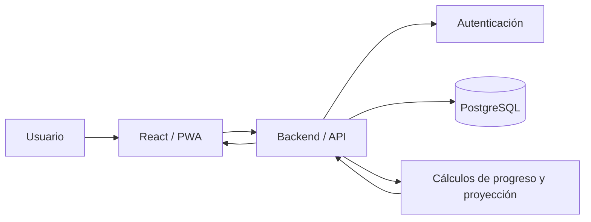

# IMPLEMENTATION BRIEF

## 1. PROJECT

**Nombre provisional:** MetaSave / Goal Journal

Sistema web personal para gestionar metas financieras, registrar movimientos de dinero, visualizar progreso, proyectar cumplimiento y reforzar disciplina de ahorro.

El nombre definitivo queda abierto para la implementación.

---

## 2. REQUEST

Construir una aplicación web personal, responsive y mobile-first, desarrollada con React, desplegada mediante Git en Vercel y preparada como PWA para poder instalarse y utilizarse cómodamente desde un teléfono.

La aplicación debe permitir crear metas para comprar, pagar, conseguir o ahorrar una cantidad determinada; registrar aportes positivos y movimientos negativos; visualizar el progreso mediante gráficas y calendario/journal; comparar planificación contra ejecución; y proporcionar información orientada a disciplina y cumplimiento.

La implementación será realizada por OpenCode después de una fase inicial de análisis técnico y validación del proyecto existente.

---

## 3. PROBLEM

Una meta financiera normalmente se gestiona de forma manual o con información fragmentada. Esto dificulta responder:

- cuánto dinero se necesita;
- cuánto se ha conseguido;
- cuánto falta;
- cuándo se alcanzará la meta;
- si el ritmo actual es suficiente;
- cuánto debería aportarse periódicamente;
- cuándo fue el último movimiento;
- si el comportamiento real está cumpliendo el plan.

Además, un simple registro de saldo no aporta disciplina ni contexto temporal.

---

## 4. OBJECTIVE

Crear un sistema personal que convierta cada objetivo financiero en una meta medible y accionable.

El sistema debe combinar:

1. **Seguimiento:** registrar y visualizar lo ocurrido.
2. **Planificación:** definir cómo se espera alcanzar el objetivo.
3. **Proyección:** estimar cuándo se alcanzará.
4. **Disciplina:** identificar desviaciones y comunicar qué tan cerca o lejos está el usuario del ritmo necesario.
5. **Journal:** conservar el historial temporal de movimientos.
6. **Visualización:** mostrar claramente evolución, progreso y estado.

---

## 5. SCOPE

### MVP

- Autenticación/login para el único usuario.
- Dashboard global.
- Crear meta.
- Editar meta.
- Cambiar estado de meta.
- Registrar movimientos positivos y negativos.
- Historial de movimientos.
- Calendario/journal.
- Porcentaje de progreso.
- Monto acumulado.
- Monto restante.
- Curva de progreso.
- Fecha de inicio.
- Fecha objetivo o modalidad sin fecha.
- Plan de aportes.
- Modalidad flexible de aportes.
- Proyección.
- Comparación planificado vs real cuando exista planificación.
- Indicador de ritmo: en ritmo / necesita atención / atrasada, según reglas que se definan en la fase de análisis.
- Diseño responsive mobile-first.
- PWA.
- Despliegue preparado para Vercel + Git.
- Persistencia en base de datos.

### Principios de UX

- La aplicación debe ser rápida de entender.
- Las acciones frecuentes deben requerir pocos pasos.
- Crear una meta debe realizarse mediante un modal reutilizable.
- El formulario de meta será dinámico.
- Los campos se mostrarán según decisiones previas.
- Todos los campos aplicables son obligatorios.
- No debe haber campos funcionales dejados accidentalmente vacíos.
- Los valores calculables deben ser calculados por el sistema y no solicitados al usuario.
- El mismo formulario conceptual debe servir para crear y editar.

---

## 6. OUT OF SCOPE

No construir inicialmente:

- aplicación Android/iOS nativa;
- multiusuario;
- roles y permisos complejos;
- cuentas bancarias;
- conexión con bancos;
- pagos reales;
- inversiones;
- sincronización bancaria;
- criptomonedas;
- microservicios;
- Kubernetes;
- Redis;
- Kafka;
- arquitectura distribuida innecesaria;
- funcionalidades sociales;
- marketplace;
- sistema contable completo.

Estas funcionalidades podrán evaluarse posteriormente, pero no forman parte del MVP.

---

## 7. CURRENT STATE

El proyecto parte como proyecto nuevo.

No existe una estructura de código existente que deba conservarse, salvo los archivos de planificación entregados a OpenCode.

La intención tecnológica conocida es:

- Frontend: React.
- Repositorio: Git.
- Hosting frontend/despliegue: Vercel.
- Base de datos: PostgreSQL o MySQL disponible remotamente en infraestructura de Namecheap, sujeto a validación técnica.
- PWA: requerida.
- Responsive: requerido al 100%.
- Mobile-first: requerido.

La base de datos concreta y la estrategia de backend deberán validarse durante el análisis técnico inicial de OpenCode, priorizando PostgreSQL si el entorno lo soporta correctamente.

---

## 8. DESIRED STATE

Una aplicación personal instalada o accesible desde el teléfono que permita:

1. entrar mediante login;
2. consultar todas las metas;
3. crear una meta mediante modal;
4. definir completamente su objetivo y planificación;
5. registrar cada movimiento;
6. consultar el journal/calendario;
7. visualizar evolución;
8. conocer el ritmo necesario;
9. detectar desviaciones;
10. modificar la configuración de una meta;
11. pausar, completar o cancelar una meta;
12. consultar analítica histórica;
13. utilizar el sistema cómodamente desde móvil y desktop.

---

## 9. REQUIREMENTS

### 9.1 Usuario

El sistema será inicialmente de un único usuario.

La arquitectura debe mantener separación lógica de datos por usuario para no bloquear una futura evolución a multiusuario, pero no se implementará un sistema multiusuario en el MVP.

### 9.2 Meta

Una meta representa cualquier objetivo monetario.

Ejemplos:

- Comprar PC.
- Pagar una deuda.
- Viajar.
- Comprar un vehículo.
- Crear un fondo.
- Ahorrar para una oportunidad.

La meta no debe estar conceptualmente limitada a "ahorro".

### 9.3 Creación de meta

La creación y edición se realizará mediante un modal reutilizable y responsive.

Debe existir como mínimo información equivalente a:

- nombre de meta;
- monto objetivo;
- fecha de inicio;
- configuración de fecha;
- configuración del plan;
- estado;
- categoría;
- descripción.

El conjunto final de campos y sus dependencias debe ser validado durante el análisis técnico/funcional.

### 9.4 Formulario dinámico

El formulario debe reaccionar a las decisiones del usuario.

Ejemplo:

- Si la meta tiene fecha objetivo, debe solicitar fecha objetivo.
- Si la meta es sin fecha, debe registrar explícitamente esa modalidad.
- Si se selecciona plan periódico, deben aparecer los campos necesarios para definir periodicidad y monto.
- Si se selecciona modalidad flexible, los campos periódicos que ya no aplican no deben quedar activos.
- Cuando un campo deja de aplicar, su valor dependiente debe limpiarse o invalidarse de forma controlada.
- Antes de guardar debe existir una validación completa.

### 9.5 Campos obligatorios

No existen campos opcionales dentro de la configuración funcional.

"Sin fecha", "Flexible" u otra modalidad equivalente debe ser un valor explícito, nunca una ausencia accidental de información.

### 9.6 Movimientos

Una meta tendrá un historial de movimientos.

Debe soportar:

- aporte positivo;
- movimiento negativo/retiro;
- fecha;
- valor;
- descripción o contexto del movimiento.

Los movimientos históricos representan hechos y no deben alterarse automáticamente porque posteriormente cambie la configuración de la meta.

El acumulado de una meta debe poder determinarse a partir de sus movimientos.

### 9.7 Planificación

El usuario debe poder elegir entre:

- plan periódico;
- aportes flexibles.

El plan periódico debe contemplar como mínimo:

- diario;
- semanal;
- mensual;
- configuración personalizada si resulta justificada durante el análisis.

La modalidad flexible permite registrar dinero cuando el usuario disponga de él sin exigir una cantidad fija por periodo.

### 9.8 Fecha

Una meta puede ser:

- con fecha objetivo;
- sin fecha objetivo.

La fecha de inicio forma parte de la configuración de la meta.

### 9.9 Estados

La meta debe tener estado administrativo.

Como conjunto inicial:

- ACTIVA;
- PAUSADA;
- COMPLETADA;
- CANCELADA.

Debe existir una separación conceptual entre estado administrativo y estado de rendimiento.

El rendimiento puede calcularse como:

- EN RITMO;
- NECESITA ATENCIÓN;
- ATRASADA;
- OBJETIVO ALCANZADO.

Las reglas exactas deben quedar definidas antes de implementar los cálculos.

### 9.10 Modificación

Las metas pueden editarse después de creadas.

Cambiar el objetivo, fechas o configuración no debe reescribir artificialmente los movimientos históricos.

Cuando corresponda, los cálculos futuros deben recalcularse con la configuración vigente.

### 9.11 Dashboard

Debe mostrar, como mínimo:

- total de metas;
- total objetivo;
- total acumulado;
- total pendiente;
- progreso global;
- resumen de metas;
- metas completadas;
- metas que requieren atención;
- actividad reciente.

### 9.12 Journal / Calendario

Debe permitir consultar movimientos por fecha.

Debe ser usable en móvil.

Debe permitir visualizar:

- días con actividad;
- aportes;
- retiros;
- total del día;
- detalle del movimiento.

### 9.13 Analítica

Debe permitir analizar:

- progreso;
- aportes por periodo;
- retiros;
- promedio de aporte;
- frecuencia de movimientos;
- evolución temporal;
- plan vs real cuando exista planificación;
- desviación;
- velocidad de acumulación.

No se deben añadir métricas sin utilidad para la toma de decisiones.

### 9.14 Proyección

Cuando exista información suficiente, el sistema debe poder estimar:

- monto restante;
- ritmo necesario;
- aporte diario equivalente;
- aporte semanal equivalente;
- aporte mensual equivalente;
- fecha proyectada de cumplimiento.

Una meta sin fecha debe permitir proyección basada en comportamiento histórico cuando exista suficiente información.

### 9.15 Disciplina

La aplicación debe ir más allá del simple seguimiento.

Debe identificar:

- si el usuario está en ritmo;
- si está por debajo del ritmo esperado;
- cuánto debería aportar para recuperar el ritmo;
- si la fecha objetivo está en riesgo;
- cuándo fue el último movimiento.

Los mensajes deben ser accionables y basados en datos, no simplemente motivacionales.

### 9.16 Responsive

La aplicación debe ser 100% responsive.

Debe funcionar en:

- teléfonos pequeños;
- teléfonos grandes;
- tablets;
- laptops;
- desktop;
- monitores grandes.

Mobile-first.

No deben existir funcionalidades importantes exclusivas de desktop.

### 9.17 PWA

La aplicación debe poder instalarse como PWA desde navegadores compatibles.

Debe incluir la configuración necesaria para:

- manifest;
- iconos;
- comportamiento instalable;
- experiencia adecuada en móvil.

El comportamiento offline avanzado queda fuera del MVP salvo que el análisis determine que una capacidad mínima sea necesaria para una buena PWA.

### 9.18 Git

Todo cambio de código debe pasar por Git.

OpenCode debe:

- revisar el estado del repositorio;
- trabajar con commits lógicos;
- evitar cambios no relacionados;
- documentar los cambios;
- verificar el resultado antes de considerar una tarea terminada.

No se deben hacer commits automáticos de secretos.

---

## 10. BUSINESS RULES

### BR-001 — Objetivo

Una meta tiene un monto objetivo positivo.

### BR-002 — Movimientos

Los movimientos pueden incrementar o disminuir el acumulado.

### BR-003 — Historial

Los movimientos históricos representan hechos y deben conservar su fecha y valor.

### BR-004 — Saldo acumulado

El progreso financiero se calcula a partir de los movimientos válidos asociados a la meta.

### BR-005 — No sobreescribir historia

Modificar una meta no debe modificar retroactivamente los movimientos.

### BR-006 — Fecha

Una meta debe declarar explícitamente si tiene fecha objetivo o si es indefinida.

### BR-007 — Plan

Una meta debe declarar explícitamente si usa planificación periódica o modalidad flexible.

### BR-008 — Campos dependientes

Los campos condicionales deben ser coherentes con la selección que los habilitó.

### BR-009 — Estado

El estado administrativo debe distinguirse del estado de rendimiento calculado.

### BR-010 — Completada

La condición exacta de completitud deberá definirse durante el análisis, considerando al menos objetivo y acumulado.

### BR-011 — Proyección

Las proyecciones no deben presentarse como garantías. Deben identificarse como estimaciones basadas en datos disponibles.

### BR-012 — Disciplina

Las alertas de ritmo deben depender de datos reales y del plan/fecha configurados, no de mensajes arbitrarios.

---

## 11. SELECTED SOLUTION

### Arquitectura recomendada

Aplicación web monolítica/modular, simple y mantenible:

```text
Usuario
   |
   v
React + UI Responsive
   |
   v
Backend/API
   |
   v
PostgreSQL
```

Despliegue:

```text
Git
 |
 v
Repositorio remoto
 |
 v
Vercel
 |
 +--> Frontend
 |
 +--> Backend/API si la solución seleccionada lo permite
 |
 v
Base de datos PostgreSQL remota
```

### Decisión de base de datos

Se recomienda PostgreSQL sobre MySQL por sus capacidades relacionales, consistencia, tipos, constraints y facilidad para consultas analíticas.

Sin embargo, antes de implementarlo OpenCode debe verificar las capacidades reales del hosting de Namecheap:

- acceso remoto;
- firewall;
- SSL/TLS;
- usuario;
- permisos;
- conexión desde Vercel;
- latencia;
- límites;
- compatibilidad.

Si Namecheap no proporciona una conexión segura y confiable desde el entorno de despliegue, OpenCode debe detenerse en el punto de infraestructura y reportarlo antes de improvisar.

No debe exponerse una base de datos directamente al navegador.

### Backend

Debe existir una capa backend/API entre frontend y base de datos.

El navegador no debe contener credenciales de base de datos.

La tecnología concreta del backend deberá seleccionarse durante el análisis en función de Vercel, la arquitectura React y el acceso a PostgreSQL.

### Principio de simplicidad

No introducir:

- microservicios;
- colas;
- Redis;
- Kafka;
- Kubernetes;
- event buses;
- infraestructura adicional;

salvo que exista una necesidad demostrable.

---

## 12. ALTERNATIVES CONSIDERED

### A — React + API + PostgreSQL

**Recomendada.**

Ventajas:

- arquitectura clara;
- separación frontend/backend;
- base relacional sólida;
- buena trazabilidad;
- fácil crecimiento;
- apropiada para datos financieros personales.

Desventajas:

- requiere definir despliegue del backend;
- requiere conexión segura entre backend y base de datos.

### B — React + API + MySQL

Viable si Namecheap ofrece mejor soporte para MySQL remoto.

Ventajas:

- familiaridad;
- disponibilidad frecuente en hosting;
- buena compatibilidad.

Desventajas:

- menos conveniente para algunas necesidades analíticas y de modelado que podrían aparecer;
- dependerá de las capacidades reales del hosting.

### C — React + servicio BaaS

Puede simplificar autenticación, base de datos y API.

Se descarta como solución inicial por no ser necesario introducir un servicio externo adicional mientras el hosting existente pueda satisfacer los requisitos.

---

## 13. ARCHITECTURE

La arquitectura definitiva deberá ser validada por OpenCode durante la fase de análisis inicial.

Componentes esperados:

- React frontend;
- sistema de componentes UI responsive;
- gestión de estado adecuada al tamaño de la aplicación;
- API/backend;
- PostgreSQL recomendado;
- autenticación;
- capa de acceso a datos;
- validación;
- testing;
- PWA.

### Flujo principal



---

## 14. DATA MODEL

El modelo conceptual debe contemplar al menos:

### User

Representa el usuario autenticado.

### Goal

Representa la meta.

Conceptualmente:

- id;
- user_id;
- name;
- description;
- target_amount;
- start_date;
- target_date o modalidad sin fecha;
- planning_mode;
- status;
- category;
- configuración necesaria para el plan;
- timestamps.

### GoalMovement

Representa un hecho financiero.

Conceptualmente:

- id;
- goal_id;
- date;
- type;
- amount;
- description;
- timestamps.

### GoalPlan

Puede ser una entidad separada o parte de Goal según el diseño final.

Debe representar:

- modalidad;
- periodicidad;
- monto esperado;
- configuración necesaria para una planificación personalizada.

### Consideración importante

Los campos calculados como:

- accumulated_amount;
- remaining_amount;
- progress_percentage;
- required_rate;
- projected_date;
- performance_status;

no deben almacenarse duplicadamente sin una razón técnica clara. Preferir cálculo derivado, vistas o estrategias controladas para evitar inconsistencias.

El esquema final debe incluir:

- PK;
- FK;
- constraints;
- índices;
- integridad referencial;
- precisión monetaria adecuada;
- timestamps;
- estrategia de eliminación/archivado.

No usar tipos de coma flotante para dinero.

---

## 15. API CONTRACTS

OpenCode debe definir y documentar contratos antes de implementar la capa correspondiente.

Como mínimo se esperan operaciones conceptuales para:

### Auth

- login;
- logout;
- sesión actual.

### Goals

- listar metas;
- obtener meta;
- crear meta;
- actualizar meta;
- cambiar estado;
- eliminar/cancelar según regla definida.

### Movements

- listar movimientos;
- registrar movimiento;
- editar movimiento si se permite;
- eliminar movimiento si se permite.

### Analytics

- resumen dashboard;
- progreso;
- actividad;
- métricas.

### Projection

- cálculo de proyección;
- ritmo necesario;
- fecha estimada.

Los endpoints exactos, payloads, códigos HTTP y errores deben quedar documentados por OpenCode antes de implementar.

---

## 16. FRONTEND / UX

### Navegación

Conceptualmente:

- Dashboard;
- Metas;
- Journal;
- Analítica;
- Proyección;
- Configuración.

Login es el punto de acceso.

### Dashboard

Debe priorizar información accionable.

### Metas

Vista de todas las metas con:

- nombre;
- progreso;
- acumulado;
- objetivo;
- restante;
- estado;
- indicador de rendimiento.

### Detalle de meta

Debe concentrar:

- resumen;
- curva de progreso;
- movimientos;
- calendario;
- planificación;
- proyección;
- estado;
- acciones.

### Modal de meta

Debe ser reutilizable para:

- crear;
- editar.

Debe ser dinámico.

### Movimiento

Debe existir una acción clara y rápida para registrar:

- aporte;
- retiro/movimiento negativo.

### Responsive

En móvil:

- navegación adaptada;
- controles táctiles;
- formularios verticales;
- tablas transformadas cuando sea necesario;
- gráficas legibles;
- calendario usable;
- modales adaptados a pantalla completa cuando corresponda.

---

## 17. SECURITY

Requisitos mínimos:

- no exponer credenciales de base de datos al frontend;
- secretos únicamente mediante variables de entorno;
- contraseñas almacenadas mediante hash seguro si se implementa autenticación propia;
- sesiones/token gestionados de forma segura;
- validación frontend y backend;
- autorización en cada operación;
- impedir acceso a metas de otro usuario aunque inicialmente exista un único usuario;
- protección contra inyección SQL mediante consultas parametrizadas/ORM seguro;
- protección de XSS;
- protección CSRF cuando corresponda al mecanismo de sesión;
- rate limiting en autenticación si resulta aplicable;
- no registrar contraseñas ni secretos;
- conexión cifrada a la base de datos;
- HTTPS;
- manejo seguro de errores sin filtrar información interna.

---

## 18. PERFORMANCE

El volumen inicial será pequeño porque el sistema es personal.

No optimizar prematuramente.

Prioridades:

- consultas eficientes;
- índices adecuados;
- evitar N+1;
- paginar historiales si posteriormente crecen;
- cargar analítica de forma razonable;
- evitar recalcular innecesariamente;
- bundle frontend razonable;
- gráficas eficientes.

No introducir cache distribuido.

---

## 19. BACKLOG

### P0

**TASK-001 — Análisis técnico inicial**

Objetivo: inspeccionar entorno, restricciones y decisiones técnicas.

Acceptance Criteria:

- arquitectura propuesta;
- stack definitivo;
- estrategia de backend;
- base de datos seleccionada;
- estrategia de autenticación;
- estrategia PWA;
- riesgos identificados;
- compatibilidad con Vercel y Namecheap validada.

**TASK-002 — Inicializar proyecto**

Objetivo: preparar repositorio y estructura base.

**TASK-003 — Configurar base de datos**

Objetivo: crear esquema, migraciones y constraints.

**TASK-004 — Autenticación**

Objetivo: permitir acceso seguro del usuario.

**TASK-005 — Modelo de metas**

Objetivo: persistir configuración completa de metas.

**TASK-006 — CRUD de metas**

Objetivo: crear, consultar, modificar y gestionar estados.

**TASK-007 — Formulario dinámico de meta**

Objetivo: implementar modal responsive con dependencias y validación.

**TASK-008 — Movimientos**

Objetivo: registrar aportes y movimientos negativos.

**TASK-009 — Journal / calendario**

Objetivo: visualizar actividad por fecha.

**TASK-010 — Dashboard**

Objetivo: mostrar resumen global y acciones prioritarias.

**TASK-011 — Curva de progreso**

Objetivo: visualizar evolución real y objetivo.

**TASK-012 — Proyección**

Objetivo: calcular ritmo y fecha estimada.

**TASK-013 — Disciplina**

Objetivo: mostrar estado de ritmo y acciones recomendadas.

**TASK-014 — Analítica**

Objetivo: analizar comportamiento histórico.

**TASK-015 — PWA y responsive**

Objetivo: experiencia completa móvil y capacidad instalable.

**TASK-016 — Testing**

Objetivo: pruebas unitarias, integración y E2E de los flujos críticos.

**TASK-017 — Despliegue**

Objetivo: configurar Git + Vercel + variables + base de datos segura.

### P1

- categorías avanzadas;
- métricas adicionales;
- exportación;
- mejoras de journal;
- recordatorios;
- rachas.

### P2

- funcionalidades avanzadas futuras.

---

## 20. DEPENDENCIES

Orden lógico:

```text
Análisis
  ↓
Arquitectura
  ↓
Base de datos
  ↓
Backend/API
  ↓
Autenticación
  ↓
Metas
  ↓
Movimientos
  ↓
Dashboard / Journal
  ↓
Proyección / Analítica / Disciplina
  ↓
Responsive / PWA
  ↓
Testing
  ↓
Deployment
```

La secuencia puede ajustarse si OpenCode encuentra una dependencia técnica real.

---

## 21. IMPLEMENTATION PLAN

### FASE 0 — ANALYSIS GATE

- inspeccionar repositorio;
- verificar entorno;
- verificar Node/React;
- verificar Vercel;
- verificar capacidades de Namecheap;
- validar PostgreSQL/MySQL;
- definir backend;
- definir autenticación;
- definir PWA;
- definir librerías justificadas;
- documentar ADR;
- identificar riesgos.

No escribir funcionalidad de negocio antes de cerrar este gate.

### FASE 1 — FOUNDATION

- inicializar proyecto;
- configurar Git;
- configurar calidad;
- configurar variables;
- configurar base;
- configurar backend;
- configurar autenticación.

### FASE 2 — GOALS

- modelo;
- migraciones;
- API;
- modal;
- formulario dinámico;
- CRUD;
- estados.

### FASE 3 — MOVEMENTS

- registrar;
- validar;
- consultar;
- editar/eliminar según decisión;
- acumulados.

### FASE 4 — JOURNAL + DASHBOARD

- calendario;
- actividad;
- resumen;
- indicadores.

### FASE 5 — ANALYTICS + PROJECTION

- curva;
- plan vs real;
- ritmo;
- proyección;
- desviaciones.

### FASE 6 — DISCIPLINE

- estado de rendimiento;
- déficit;
- recuperación;
- mensajes accionables.

### FASE 7 — PWA + RESPONSIVE

- mobile-first;
- breakpoints;
- touch;
- instalación;
- manifest;
- iconos;
- experiencia móvil.

### FASE 8 — QA

- unit;
- integration;
- E2E;
- seguridad;
- responsive;
- regresión.

### FASE 9 — DEPLOYMENT

- Git;
- Vercel;
- variables;
- DB;
- HTTPS;
- smoke tests.

---

## 22. FILES

Como proyecto nuevo, OpenCode deberá proponer la estructura real después de inspeccionar el entorno.

Debe diferenciar:

- archivos creados;
- archivos modificados;
- archivos eliminados.

No debe inventar una estructura final antes de analizar el proyecto.

Debe mantener documentación del análisis y decisiones técnicas.

---

## 23. TESTING STRATEGY

### Unit

Probar:

- cálculos monetarios;
- porcentaje;
- restante;
- reglas de estado;
- periodicidad;
- proyección;
- validación del formulario dinámico.

### Integration

Probar:

- API + DB;
- autenticación;
- creación de meta;
- modificación;
- movimientos;
- consultas.

### E2E

Flujos críticos:

1. login;
2. crear meta;
3. registrar aporte;
4. registrar movimiento negativo;
5. consultar dashboard;
6. consultar journal;
7. modificar meta;
8. verificar proyección;
9. completar meta.

### Responsive

Validar al menos:

- móvil pequeño;
- móvil estándar;
- tablet;
- laptop;
- desktop.

### Security

Validar:

- acceso no autorizado;
- inyección;
- XSS;
- manejo de sesión;
- secretos;
- endpoints protegidos.

---

## 24. ACCEPTANCE CRITERIA

### AC-001 — Crear meta

Dado que el usuario está autenticado, cuando abre "Nueva meta", puede completar toda la configuración en un modal responsive y crearla únicamente cuando todos los campos aplicables sean válidos.

### AC-002 — Formulario dinámico

Cuando una selección habilita campos dependientes, estos aparecen; cuando deja de aplicar, sus datos se invalidan/limpian correctamente.

### AC-003 — Meta sin fecha

El usuario puede crear una meta indefinida seleccionando explícitamente "Sin fecha".

### AC-004 — Plan flexible

El usuario puede crear una meta con aportes flexibles sin configurar una periodicidad artificial.

### AC-005 — Aporte

Un movimiento positivo aumenta el acumulado.

### AC-006 — Movimiento negativo

Un movimiento negativo disminuye el acumulado y queda registrado en el historial.

### AC-007 — Historial

Modificar la meta no altera movimientos históricos.

### AC-008 — Dashboard

El dashboard refleja los datos actuales de todas las metas del usuario.

### AC-009 — Journal

El usuario puede identificar los días con movimientos y consultar el detalle.

### AC-010 — Progreso

El sistema muestra acumulado, restante y porcentaje de progreso.

### AC-011 — Proyección

Cuando existen datos suficientes, el sistema muestra una estimación de cumplimiento y la presenta como proyección.

### AC-012 — Disciplina

Cuando existe un plan o fecha suficiente para evaluarlo, el sistema identifica si el ritmo está en línea, requiere atención o está atrasado, según reglas documentadas.

### AC-013 — Responsive

Todas las funcionalidades principales funcionan sin pérdida funcional en móvil.

### AC-014 — PWA

La aplicación puede instalarse desde un navegador compatible.

### AC-015 — Seguridad

Las credenciales de base de datos nunca están expuestas al cliente.

### AC-016 — Git

Los cambios de implementación quedan trazables mediante Git.

---

## 25. RISKS

### R-001 — Base de datos remota

Namecheap puede tener restricciones de conexión remota, firewall, SSL o acceso desde Vercel.

Mitigación: validar infraestructura antes de implementar.

### R-002 — Serverless + DB

Conexiones de base de datos mal gestionadas pueden generar problemas de conexiones.

Mitigación: seleccionar un driver/ORM compatible y estrategia de pooling adecuada.

### R-003 — Cálculos financieros

Errores de precisión pueden producir inconsistencias.

Mitigación: utilizar tipos monetarios adecuados y evitar floating point.

### R-004 — Proyección engañosa

Una proyección puede interpretarse como garantía.

Mitigación: etiquetar como estimación y explicar la base del cálculo.

### R-005 — Complejidad del formulario

Demasiadas dependencias pueden generar mala UX.

Mitigación: diseño progresivo dentro del mismo modal y pruebas E2E.

### R-006 — Sobreingeniería

Agregar servicios innecesarios puede complicar el sistema.

Mitigación: arquitectura simple y modular.

---

## 26. CONSTRAINTS

- Sistema inicialmente personal.
- React.
- Git obligatorio.
- Vercel como despliegue previsto.
- Responsive 100%.
- Mobile-first.
- PWA.
- Base de datos remota.
- No exponer DB al navegador.
- Todos los campos funcionales aplicables son obligatorios.
- Formulario dinámico.
- Modal reutilizable.
- No sobreescribir historial financiero.
- No introducir infraestructura innecesaria.

---

## 27. ADR / DECISIONS

### ADR-001 — Aplicación personal

El sistema se diseña inicialmente para un solo usuario, manteniendo una separación de datos compatible con futura expansión.

### ADR-002 — Mobile-first + PWA

La aplicación debe funcionar completamente desde teléfono y ser instalable como PWA.

### ADR-003 — Modal reutilizable

Crear y editar metas utilizan el mismo concepto de formulario mediante modal.

### ADR-004 — Formulario dinámico

Los campos se habilitan según decisiones previas.

### ADR-005 — Campos completos

Todos los campos funcionales aplicables son obligatorios.

### ADR-006 — Movimientos como fuente histórica

Los movimientos representan hechos y no deben reescribirse cuando cambie la configuración de la meta.

### ADR-007 — Seguimiento + disciplina

El sistema no se limita a mostrar saldo; debe interpretar ritmo, desviaciones y proyección.

### ADR-008 — Arquitectura simple

No se usarán microservicios ni infraestructura distribuida sin necesidad demostrable.

### ADR-009 — PostgreSQL recomendado

PostgreSQL es la opción preferida, condicionada a la validación de la infraestructura disponible.

---

## 28. DEFINITION OF DONE

Una funcionalidad se considera terminada cuando:

- está implementada;
- cumple los acceptance criteria;
- tiene validaciones;
- tiene manejo de errores;
- funciona en móvil y desktop cuando aplique;
- tiene tests apropiados;
- no rompe funcionalidades existentes;
- no expone secretos;
- está documentada cuando corresponde;
- el código está versionado en Git;
- OpenCode reporta archivos creados/modificados;
- los tests pasan;
- no quedan blockers conocidos.

El proyecto completo está terminado cuando todos los requisitos P0 están implementados y validados.

---

## 29. INSTRUCTIONS FOR OPENCODE

You are the implementation agent.

The product requirements in this document have already been analyzed and approved.

Your job is to first perform a technical analysis/validation gate and then implement the approved product.

Do not redesign the product without a blocking reason.

Do not perform unrelated refactors.

Do not introduce unnecessary dependencies.

Inspect the existing project/repository before modifying files.

### PHASE A — ANALYSIS BEFORE CODING

Before writing business functionality:

1. Inspect the repository and environment.
2. Determine the actual project state.
3. Verify Node, React and package manager versions.
4. Determine whether the repository is empty or already initialized.
5. Verify the Vercel deployment model.
6. Verify the available Namecheap database environment.
7. Determine whether PostgreSQL can be securely reached from the deployment environment.
8. If PostgreSQL is not viable, evaluate MySQL.
9. Define the backend/API strategy.
10. Define authentication strategy.
11. Define PWA strategy.
12. Define responsive/UI strategy.
13. Select only necessary dependencies.
14. Define database schema.
15. Define API contracts.
16. Define validation rules.
17. Define calculation rules for progress, projection and discipline.
18. Define testing strategy.
19. Identify security risks.
20. Produce/update technical planning documentation.
21. Record important technical decisions as ADRs.

### ANALYSIS GATE

Do not start normal feature implementation until the analysis has resolved all blocking technical questions.

If a blocking infrastructure problem exists, STOP.

Report:

- blocker;
- reason;
- affected component;
- affected task;
- evidence;
- recommended options.

Do not invent infrastructure capabilities.

### DATABASE

Prefer PostgreSQL.

Validate:

- remote access;
- SSL/TLS;
- credentials;
- firewall;
- connectivity from Vercel/server environment;
- connection pooling;
- limits.

The database must never be accessed directly from browser code.

Use migrations.

Do not use floating-point types for money.

### PRODUCT RULES

Preserve these decisions:

- one personal user initially;
- goals can represent buying, paying, obtaining or saving;
- positive and negative movements are supported;
- historical movements are preserved;
- goals are editable;
- goals have administrative states;
- performance state is calculated separately;
- goals can have a target date or explicitly be indefinite;
- plans can be periodic or flexible;
- all applicable form fields are required;
- goal form is dynamic;
- goal form is reusable for create/edit;
- application is mobile-first;
- application is fully responsive;
- application is a PWA;
- system combines tracking and discipline.

### FORM DESIGN

The goal form must not be a static list of every possible field.

Use progressive disclosure.

When a field enables another field, show it.

When a choice makes a dependent field irrelevant, clear/invalidate that dependent value.

Never silently preserve contradictory configuration.

Before submission validate the entire resulting goal configuration.

### FINANCIAL CALCULATIONS

Use precise monetary representation.

Define and test:

- accumulated amount;
- remaining amount;
- percentage;
- period progress;
- required rate;
- plan vs actual;
- projected date;
- performance state.

Document the formulas.

Avoid presenting estimates as guarantees.

### RESPONSIVE/PWA

Treat responsive behavior as a first-class requirement.

Test:

- small mobile;
- standard mobile;
- tablet;
- laptop;
- desktop.

Do not hide important functionality on mobile.

Forms, calendars, charts, tables and modals must remain usable with touch input.

### GIT

Use Git throughout implementation.

Create logical commits where appropriate.

Never commit:

- passwords;
- database credentials;
- API keys;
- private secrets;
- local environment files containing secrets.

### TESTING

Implement tests according to the testing strategy.

At minimum cover:

- goal creation;
- dynamic validation;
- goal editing;
- positive movement;
- negative movement;
- calculations;
- projection;
- discipline rules;
- authentication;
- authorization;
- critical E2E flows;
- responsive behavior where practical.

### IMPLEMENTATION ORDER

Follow dependency order:

1. analysis;
2. foundation;
3. database;
4. backend/API;
5. authentication;
6. goals;
7. movements;
8. journal/dashboard;
9. projection/analytics;
10. discipline;
11. PWA/responsive;
12. QA;
13. deployment.

### STOP CONDITIONS

STOP instead of improvising if:

- infrastructure access is impossible;
- database compatibility is unknown and blocking;
- authentication requirements conflict;
- a requirement is internally contradictory;
- a security-critical decision cannot be resolved;
- an implementation would violate the approved architecture;
- a major dependency is unavailable.

When blocked, do not write a workaround that changes the product.

### FINAL REPORT

At the end report:

- completed tasks;
- created files;
- modified files;
- deleted files;
- technical decisions;
- tests executed;
- test results;
- acceptance criteria status;
- deployment status;
- problems;
- remaining work;
- Git status/commits.

The implementation is complete only when the Definition of Done is satisfied.
